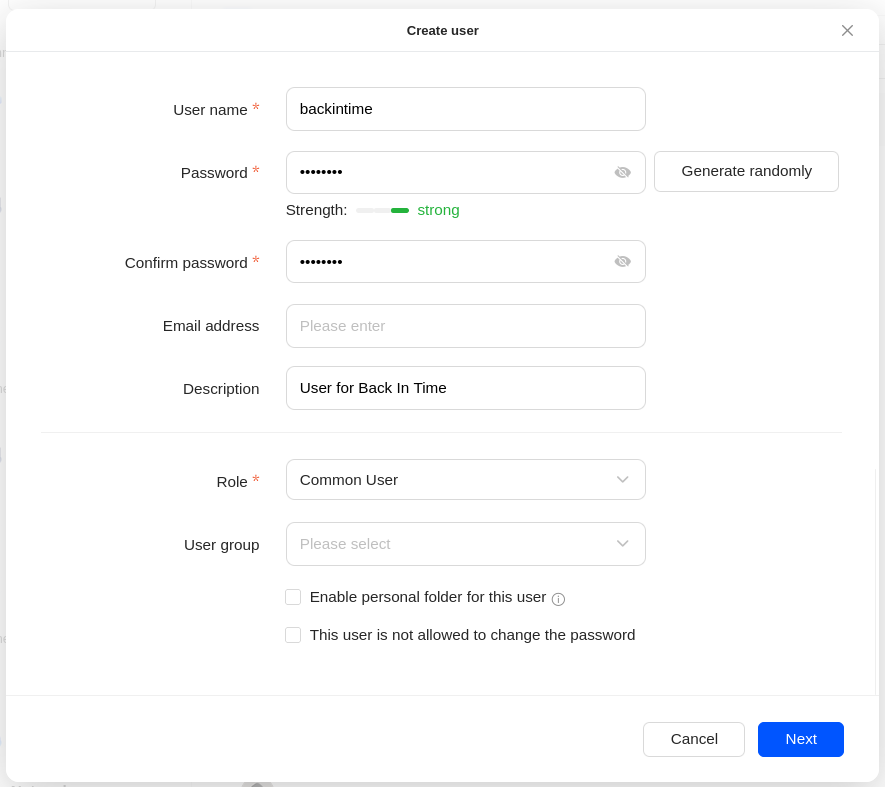
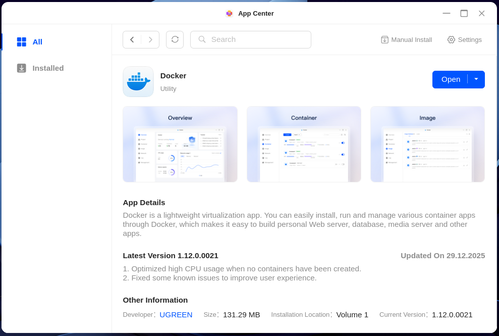
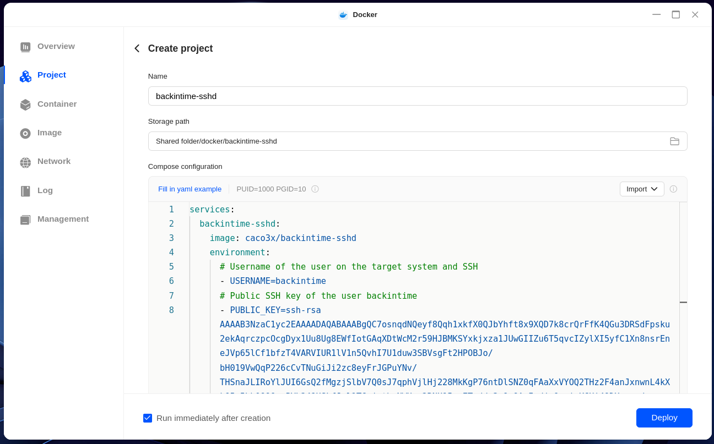

# Backintime-sshd

## Overview

Docker container to provide a ready-to-go sshd-server for /volume1/backintime.
Run this container on your backup target (eg. NAS) and no longer depend on the natively installed sshd-server and rsync.

This image is based on the work of [https://github.com/Hermsi1337/docker-sshd](https://github.com/Hermsi1337/docker-sshd) but is adapted and simplified to the needs of [Back In Time](https://github.com/bit-team/backintime).

## Prebuild Images

For recent versions check [Dockerhub](https://hub.docker.com/repository/docker/caco3x/backintime-sshd).

## Docker Compose
See example in [docker-compose.yaml](docker-compose.yaml)

### Environment variables

| Variable | Explanation |
|:-----------------:|:------------------------------------------------------------------------------------------------------------------------------------:|
| USERNAME | Username on the host system and SSH, usually backintime |
| PUBLIC_KEY | SSH public key for user authentication |

# Preparations on your remote host
The remote host is where your backups will be stored, eg. a designated Linux machine or a NAS. See the [Back In Time documentation](https://backintime.readthedocs.io/en/latest/#ssh) for details.

The following screenshots show the preparations on an Ugreen NAS, but can be adapted to any Linux system.

1. Create a normal user on the remote host. Ideally call it `backintime`:

    

1. Install the docker app:

    

1. Create a new docker compose project:
    

    Use to the example [Docker Compose file](docker-compose.yaml).
1. Add the SSH Publik Key to the `PUBLIC_KEY` variable (replace the example key).

1. If you did not use `backintime` for the user name, you must set the correct name in `USERNAME`.

## Move your existing backups
The next steps only apply if you already have [Back In Time](https://github.com/bit-team/backintime) backups.

1. Move your existing backups to the new location on the remote host.
1. Make sure the access rights and owner of the existing backup data is set correctly. This can eg. be done with the follwoing commands (`/volume1/backintime` refers to the backup data location):
    ```bash
    sudo chown backintime:users /volume1/backintime -R
    sudo chmod 755 /volume1/backintime“
    ```

1. Start the container.

1. On you your PC resp. the device which runs the Back In Time application run the following command to make sure the password-less SSH connection is possible:
    ```bash
    ssh -i /path/to/the/id_rsa/file backintime@remote-host-ip -p 10022
    ``` 
    Replace `/path/to/the/id_rsa/file` with the path to your private key and `remote-host-ip` with the IP address of your remote host.
    

# Configuration in Back In Time
1. Setup [Back In Time](https://github.com/bit-team/backintime) as normal. Below are the required parameters for SSH documented:
    - yxxx 
    - yxxx 